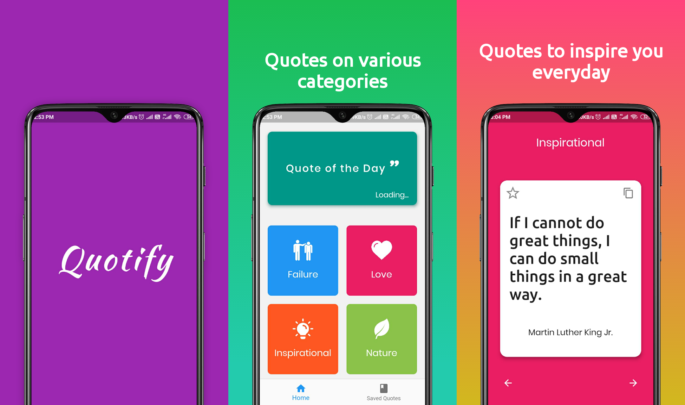

# Quotify

Quotify is an app made to motivate you everyday with inspiring quotes. View quotes on various categories and save them offline or copy and share them with friends.

## Download

## Notes
The App uses Clean Architecture with BLoC for state management. You can learn more about this architecture [here](https://resocoder.com/2019/08/27/flutter-tdd-clean-architecture-course-1-explanation-project-structure/#Next_up8230).

## Meta

Ibtesam Ansari – [LinkedIn](https://www.linkedin.com/in/ibtesamansari/) – ibtesamansari070@gmail.com

[https://github.com/ibtesam123](https://github.com/ibtesam123)

## Contributing

1. Fork it (<https://github.com/ibtesam123/Quotify-App/fork>)
2. Create your feature branch (`git checkout -b feature/fooBar`)
3. Commit your changes (`git commit -m 'Add some fooBar'`)
4. Push to the branch (`git push origin feature/fooBar`)
5. Create a new Pull Request
